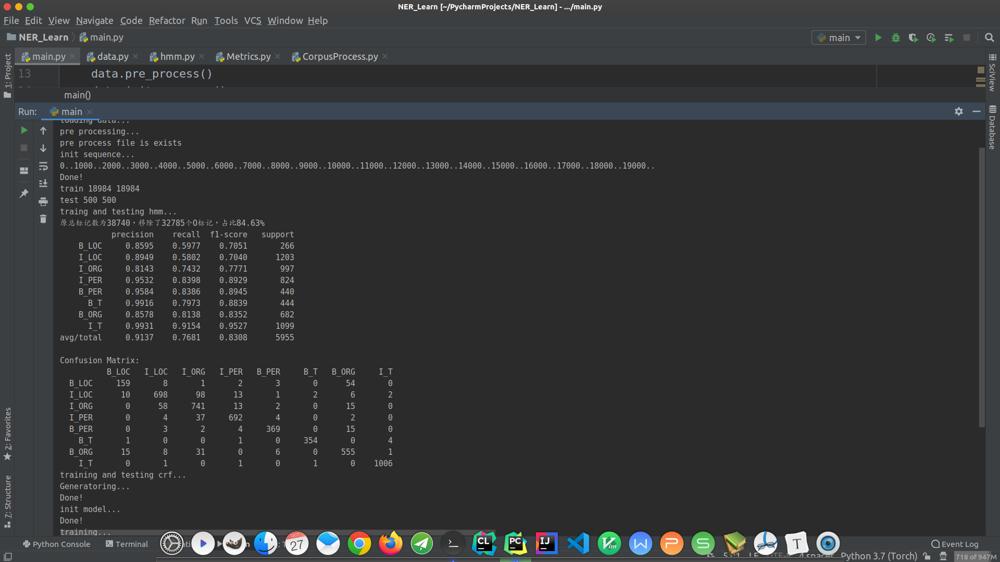
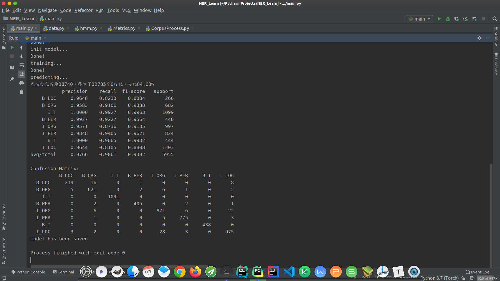

# 多模型命名实体识别
* 当前模型包括：
    > hmm \
    ctf
## 结果：
pku98语料：
* hmm:

* crf:

***
# 基于隐马尔可夫模型和条件随机场的命名实体识别任务

## liou

***

## 摘要

* 结合上课所学习内容，并且考量了当前主流NLP工具使用方法，在综合考虑了效率和效果之后最终选定本次实验选用HMM和CRF两种模型，并且相关代码开源：https://github.com/bitcodewoker/NER_Learn。

* 实验内容：

  * 手动实现了HMM模型。

  * 对比使用两种CRF模型框架：crf++和sklearn crfsuite，阅读并注释crf++代码，注释代码位置：https://github.com/bitcodewoker/CRF_Learn。

  * 实现模型需要其他模块：数据预处理、模版特征提取、模型混淆矩阵计算等。

* 评估方法：

  * 采用pku9801数据库。
  * 采用BIO标注方式，对时间、人名、组织和地名四种命名实体进行识别。
  * 对crf评估过程中分为接受分词和不接受分词两种：
    * 接受分词即在分词基础上进行识别，评估过程中只考虑复合词标注情况。
    * 不接受分词即针对字进行标注，评估过程中考虑所有词。
  * 根据模型分类结果计算f1值和混淆矩阵，计算过程中忽略other标签也就是非实体影响。

* 实验结果：

  * HMM模型全部标签f1平均值83.08。
  * crf模型：
    * 接受分词仅考虑复合词：f1均值80.34。
    * 不接受分词考虑全部词：f1均值93.92。

  详细见实验结果部分。

## 实验过程

### 理论学习和模型选择

* 本人之前有过一些深度学习经历，但是对机器学习的学习和实践经历并不是非常丰富，所以借这次机会希望能够学习并尝试一下传统机器学习的模型和方法。
* 首先阅读了何晗(@hankcs)老师的《自然语言处理入门》，选择这本书的原因是作者本身是nlp工具hanlp的作者，并且书中介绍到很多机器学习方法和在hanlp中的具体实现细节。并根据这本书大致阅读了hanlp源代码，hanlp源代码使用java编写并提供python接口，也就此机会提升一下我糟糕的java基础。总体来讲收获颇为丰富。
* 书中着重提到的机器学习模型包括隐马尔可夫模型、感知机和结构化感知机、条件随机场、支持向量机等，本次主要选择更为不熟悉的隐马尔可夫模型和条件随机场模型。
  * 对于隐马尔可夫模型，则着重学习了其朴素实现方法，顺便了解了一些马尔可夫模型的变体，如多阶HMM和MEMM等。但还是更偏爱于朴素写法的简洁和直观，并且最终效果也还算不错。
  * 对条件随机场的学习过程中查阅了大量资料，包括《自然语言处理入门》和《统计学习方法》等书籍的相关部分、李宏毅老师相关视频课程、原论文相关解读和其他网络教程和资料。总体上对模型的方法和公式推导有了一定了解，尤其包括其中快速求梯度的前向后向算法等模型细节的实现。

### 模型实现

##### HMM

* 隐马尔可夫模型是符合马尔可夫假设的链状模型，包括状态序列与观测序列。当前模型状态仅被前一状态决定，当前观测状态仅被当前模型状态所决定。
* HMM模型朴素方法主要维护三类参数：发射矩阵、转移矩阵和初始值。
  * 初始值：初始值描述了模型初始状态下的各个状态概率分布。
  * 转移矩阵：转移矩阵维护了当前状态向下一状态转移的概率。
  * 发射矩阵：发射矩阵维护了当前状态产生观测值的概率。
* 在不接受分词时，也就是仅需要考虑单个字的情况下，常用的单字数并不会非常多，经过统计pku98数据集中不同字数在4600左右，转移矩阵的参数量在字典数的平方量级，所以完全能够直接进行字典映射。从而在训练过程中可以直接用统计方法计算参数。
* 模型预测：维特比算法是最短路算法的一种，在分层图中具有良好的效果。所以最终模型的预测结果通过维特比算法得到。

##### CRF

* 在学习阶段本来打算根据第三方库简单复现crf模型，并且已经写好了一部分python接口代码，但是在对第三方库源码的研究过程中发现复现工程量巨大，并且涉及到的知识面非常广，自我感觉并不能够在短时间内复现出一个稳定的版本，所以最终选择仅针对源代码进行学习和标注。

* hmm和crf都是基于概率图的模型，并且在经过变换之后能够得到hmm和crf的本质是几乎一样的。造成二者效果区别最大的原因就在于对特征抽取的数量，也就是感受野的大小。

  * 虽然在多阶隐马尔可夫模型中也能够提高其感受野的大小，但是这就又些类似于多层感知机的方法，靠叠加层数而不改变本质。朴素hmm的可感知范围非常的小，仅根据前一状态来推测当前状态，仅根据当前状态来推测观测状态。这就让模型丧失了对大型而复杂的复合词的判别能力。

  * 而crf采用特征模版的方法扩大了模型的感受范围，增加了参数量，细化了判别过程，从而提高了模型的判别能力。本次实验中特征模版选择较为简单，约定当前时刻为$t=0$，过去时刻为负数，将来时刻为正数。x为输入变量。特征模版为：

    > * Unigram
    >
    >   > U0:%x[-1,0]
    >   >
    >   > U1:%x[0, 0]
    >   >
    >   > U2:%x[1, 0]
    >   >
    >   > U3:%x[-1, 0] %x[0, 0]
    >   >
    >   > U4:%x[0, 0] %x[1, 0]
    >
    > * Bigram
    >
    >   > B

* 参数优化的核心就在于梯度的求解，化简后的梯度为：$$\begin{array}{l}\frac{\partial L}{\partial w_{j}}=\sum_{i}^{N} \Phi_{j}(\overrightarrow{s^{i}}, \overrightarrow{x^{i}})-\sum_{i}^{N} \sum_{\vec{s}^{\prime}} \sum_{\in S^{n}} p\left(\overrightarrow{s^{\prime}} | x^{i}\right) \Phi_{j}(\overrightarrow{s^{i}}, \overrightarrow{x^{i}})\end{array}$$

  能否对右半部分进行快速计算就是crf模型实现的关键。

* 根据前向后向算法，能够快速得到该问题的解：$$p\left(s_{k-1}, s_{k} | \vec{x}\right)=\frac{\alpha\left(s_{k-1}\right) \psi\left(s_{k-1}, s_{k}\right) \beta\left(s_{k}\right)}{\psi(\vec{x})}$$,从而使用动态规划的思路快速计算梯度。

* 对于细致的公式推导这里就不再赘述了。既然有了快速计算梯度的方法，就能够使用各种优化器来更新参数。sklearn库中实现了更多的优化器，包括sgd和bfgs等，crf++则只采用bfgs方法，拟牛顿法整体收敛效果要优于梯度下降。但是本人能力有限，还不能够完全理解bfgs算法的各个细节，同时crf++该部分代码并非来自c语言，可读性较差，所以对该算法的研究还有很多欠缺。

* 模型预测依旧采用维特比最短路算法。

## 实验结果

### HMM

分析可知：

测试集中other标签占比84.63%，评估过程中忽略这些影响因素。

* 模型对时间的查准率最高，查全率较低是因为模型偶尔会搞混B和I的标签。而整个测试集5955个实体中有1099+444个关于时间的实体，这一项会拉高整体的预测平均值。
* 准确率第二的就是人名，主要原因是中文姓名具有比较明显的特征，尤其姓氏的特征明显，而且成功识别出姓氏就能较好的识别名字。
* 对于组织名和地名不能够清晰的分辨，主要原因是获取的有效信息较少，感受野较小。并不能有效处理长复合词。尤其对于：地名命名的组织、人名命名的组织、人名命名的地名等实体非常容易混淆。

### CRF(不接受分词)

分析可知：

* 判别效果最好的依旧是时间实体，查准率直接为100%，召回率也超过90%。
* 对人名的判别效果也有很大提升，f1值在95%以上。
* 依旧存在混淆地名和组织名的问题，但是出错率已经大大减少，这也进一步印证了增大模型感受野带来的性能提升。

### CRF(接受分词)

不接受分词时只考虑了复合词，所以简便选择了nt和ns两个较为简单和较为难识别的实体作为对比。

* 可以看出仅考虑复合词后f1值下降明显，整体查准率在80%以上较为客观。但是召回率则表现得很不稳定，模型仍需要更大的参数量和更细致的特征抽取方式。

由于时间因素，并没有进一步调整模型和方法。

## 总结

### 模型提升

* 造成组织名和地名的召回率较低的原因除去相互混淆之外，还由于不同于人名具有基本不变且短小的长度，组织名和地名长度多变且不确定。改进该问题的方法可以为：
  * 采用更加丰富的特征模版，从而获得更大的参数量和感受野。但同时需要加入正则化项来缓解过拟合等问题的负面影响。
  * 还可以采用更为细致的预料标注格式比如BMES甚至更为深入和细致的标注，比如：
    * 俞鸿魁、张华平和刘群教授在《基于角色标注的中文机构名识别》一文中使用始终标签来标记机构名。
    * 张华平和刘群教授在《基于角色标注的中国人名自动识别研究》一文中使用十五种标签来标记人名。
* 本次实验并没有太多关注OOV词对结果的影响。但是经过统计：pku9801数据集中oov词占比约为5.75%。而在传统的编码方式中对oov的处理能力几乎为先天缺陷，通过堆叠参数量和扩大范围能够提升一部分效果，但是难以解决根本问题，这也是词向量编码存在的意义。所以本次实验不刻意去调整模型参数和优化方法，并且不集中处理oov的问题。

### 总体感受

* 本次实验加深了对hmm和crf模型的原理和实现的理解。在深度学习时代重新感受到了简单模型和小参数量所带来的简洁和高效。重新审视了不同需求下不同模型所带来的不同效果。
* 提升了工程和代码阅读能力，了解了一些深度学习和工程中的细节比如使用log空间防止溢出，python的装饰器和使用其他语言的外部扩展等。
* python代码风格进一步提升。
* 三个晚上看完八千行的c++代码确实刺激。。。。。。
